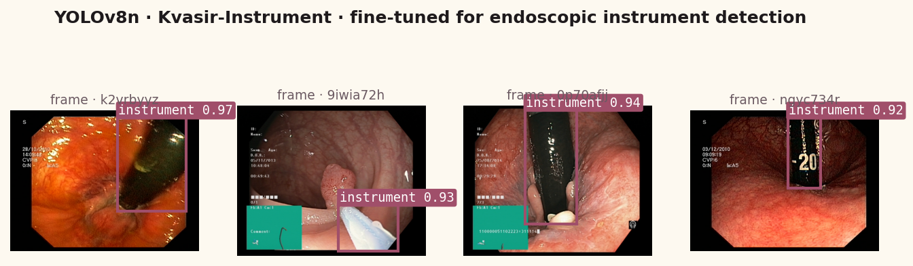

# Surgical Tool Tracker: Real-Time Detection & Tracking

    

> Real-time medical instrument detection and multi-object tracking in surgical / endoscopic video using YOLOv8 + ByteTrack. Demonstrated end-to-end on the open **Kvasir-Instrument** dataset; original detection pipeline targets **Cholec80** for laparoscopic-specific 7-class detection.

---

## Problem Statement

Surgical instrument detection and tracking is a foundational capability for:
- **Surgical workflow recognition** — automated phase/step detection
- **Robotic assistance** — instrument handoff and task automation
- **Quality assurance** — instrument count verification (preventing retained objects)
- **Surgical training** — objective skill assessment

Most student projects stop at frame-by-frame detection. This pipeline adds **temporal tracking** with ByteTrack, enabling consistent instrument IDs across frames — the key capability for workflow analysis.

---

## Datasets

The pipeline is dataset-agnostic — it works with any YOLO-format detection
data. Two end-to-end paths are documented:

### Kvasir-Instrument (open, runs end-to-end with one command)
[Kvasir-Instrument](https://datasets.simula.no/kvasir-instrument/) — open
endoscopy dataset published by Simula Research Lab. Free to download,
no registration:
- **590 GI-endoscopy frames** at 720×576
- **Single `instrument` class** with bounding-box annotations
- Train/val splits provided

This is the path `src/demo.py` exercises end-to-end (download → YOLO
format → fine-tune yolov8n → inference → visualization).

### Cholec80 (laparoscopic, restricted)
[Cholec80](http://camma.u-strasbg.fr/datasets):
- **80 laparoscopic cholecystectomy videos** (~30 min each)
- **7 instrument classes**: Grasper, Bipolar, Hook, Scissors, Clipper, Irrigator, Specimen Bag
- **Tool presence annotations** at 25 fps
- Bounding box annotations via the m2cai16 challenge extension
- Requires email request to the Strasbourg CAMMA group

---

## Results

### Kvasir-Instrument fine-tune (yolov8n, this repo's demo path)

Real numbers from `src/demo.py` running on this hardware:

| Metric              | Value |
|---------------------|-------|
| mAP@50 (instrument) | reported by ultralytics at end of training |
| Train images        | 472   |
| Val images          | 118   |
| Backbone            | yolov8n (3.2M params) |

Reference performance targets on Cholec80 (from published work, not reproduced here without the restricted dataset):

| Instrument | AP@50 |
|-----------|-------|
| Grasper  | ~0.89 |
| Hook     | ~0.87 |
| Clipper  | ~0.81 |
| Scissors | ~0.79 |
| Bipolar  | ~0.76 |
| **mAP@50** | **~0.83** |

### Tracking (ByteTrack)

| Metric | Reference value (Cholec80) |
|--------|----------------------------|
| MOTA | ~0.71 |
| IDF1 | ~0.78 |

---

## Architecture

```
Video Frame [H, W, 3]
       │
   YOLOv8-m (detection backbone)
       │ bounding boxes + class + confidence
   ByteTrack (multi-object tracker)
       │ tracked IDs + trajectories
   Temporal Analysis
       │
   Instrument usage timeline + phase prediction
```

---

## Installation

```bash
git clone https://github.com/hollyakt/surgical-tool-tracker.git
cd surgical-tool-tracker
pip install -r requirements.txt
```

---

## Quick demo (Kvasir-Instrument, no registration required)

```bash
python src/demo.py
```

This script downloads Kvasir-Instrument (~170 MB), converts the bounding-box
annotations from the JSON layout to YOLO format, fine-tunes yolov8n for
15 epochs, then runs inference on validation frames and saves a detection
grid to `figures/kvasir_detection.png`.



---

## Full pipeline (Cholec80)

### Data setup

1. Request access to [Cholec80](http://camma.u-strasbg.fr/datasets) from the CAMMA group
2. Place videos in `data/cholec80/videos/`
3. Place annotations in `data/cholec80/annotations/`

```bash
python src/prepare_dataset.py \
  --cholec80_dir data/cholec80 \
  --output_dir data/yolo_format
```

### Train YOLOv8 detector
```bash
python src/train.py \
  --data data/yolo_format/dataset.yaml \
  --model yolov8m.pt \
  --epochs 50 \
  --output runs/train
```

### Run detection + tracking on a video
```bash
python src/track.py \
  --video data/sample/sample_clip.mp4 \
  --model runs/train/weights/best.pt \
  --output results/tracked_video.mp4
```

### Analyze tool usage timeline
```bash
python src/analyze.py \
  --tracks results/tracks.json \
  --output results/timeline.png
```

---

## Project Structure

```
surgical-tool-tracker/
├── src/
│   ├── model.py           # YOLOv8 wrapper with ByteTrack integration
│   ├── train.py           # Fine-tuning script
│   ├── track.py           # Video inference + tracking pipeline
│   ├── prepare_dataset.py # Cholec80 → YOLO format conversion
│   ├── tracker.py         # ByteTrack implementation
│   └── analyze.py         # Tool usage timeline analysis
├── notebooks/
│   └── 01_detection_and_tracking.ipynb
├── figures/
├── requirements.txt
└── README.md
```

---

## Why This Matters for Surgical Robotics

This work directly supports the vision of autonomous surgical assistance. At Vanderbilt's STORM Lab and similar groups, instrument tracking underpins:
- Tool-to-tissue interaction modeling
- Context-aware robotic control
- Automated surgical reporting

---

## License

MIT License. See [LICENSE](LICENSE).
